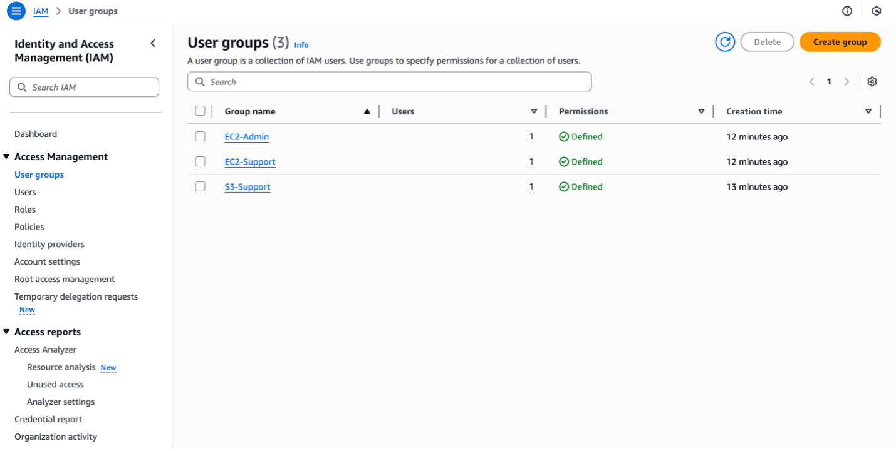

# AWS Identity Managenent

AWS IAM Lab: Introduction to Identity and Access Management
Overview
This repository contains the documentation and configuration details for a lab exploring AWS Identity and Access Management (IAM). The lab focuses on managing users, security credentials, and permissions to control access to AWS resources.

Objectives
Create IAM Users and Groups.

Apply IAM Policies to groups to define specific capabilities.

Demonstrate a real-world scenario by adding users to groups based on job functions.

Use the IAM Sign-in URL to test account access.

Experiment with the effects of policies on service access.
_____________________________________________________________________________________________
# Lab Configuration

1. User & Group Assignments
The following users and groups were created to simulate a corporate environment:

| User | Group | Permissions Inherited |
| :--- | :---: | ---: |
| user-1 | S3-Support | Read-Only access to Amazon S3 |
| :--- | :---: | ---: |
| user-2 | EC2-Support | Read-Only access to Amazon EC2 |
| :--- | :---: | ---: |
| user-3 | EC2-Admin | View, Start, and Stop Amazon EC2 instances |

2. Applied Policies
Specific AWS-managed policies were attached to each group to enforce the principle of least privilege:

S3-Support Group: Attached AmazonS3ReadOnlyAccess, which grants permissions to Get and List resources in S3.

EC2-Support Group: Attached AmazonEC2ReadOnlyAccess.

EC2-Admin Group: Attached AmazonEC2FullAccess.

____________________________________________________________________________________________
# Key Tasks Performed
Identity Management

User Setup: Created user-1, user-2, and user-3.

Security Credentials: Enabled console access for users and configured autogenerated passwords.

Group Management: Created the S3-Support, EC2-Support, and EC2-Admin groups and assigned users to them.

Permission Testing (Validation)
To test the effectiveness of IAM policies, user-1 was used to log in via the IAM sign-in URL:

Action: Attempted to create a new S3 bucket.

Result: The action failed.

Reasoning: user-1 only has the AmazonS3ReadOnlyAccess policy, which does not include the s3:CreateBucket permission.

_______________________________________________________________________________________________
#Conclusion
The lab successfully demonstrates how IAM provides centralized control over AWS identities. By utilizing groups and managed policies, administrators can ensure users have exactly the access they need for their roles without compromising account security.

